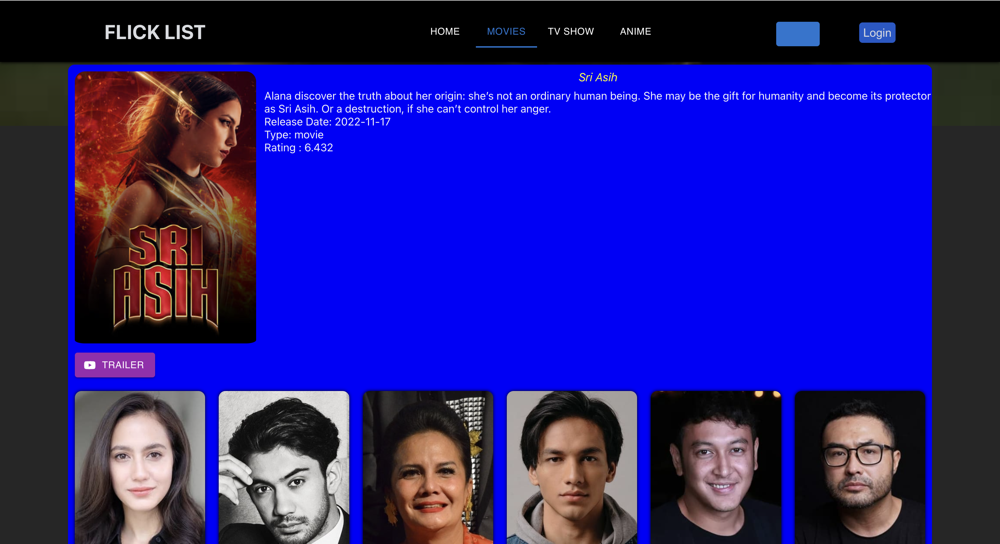
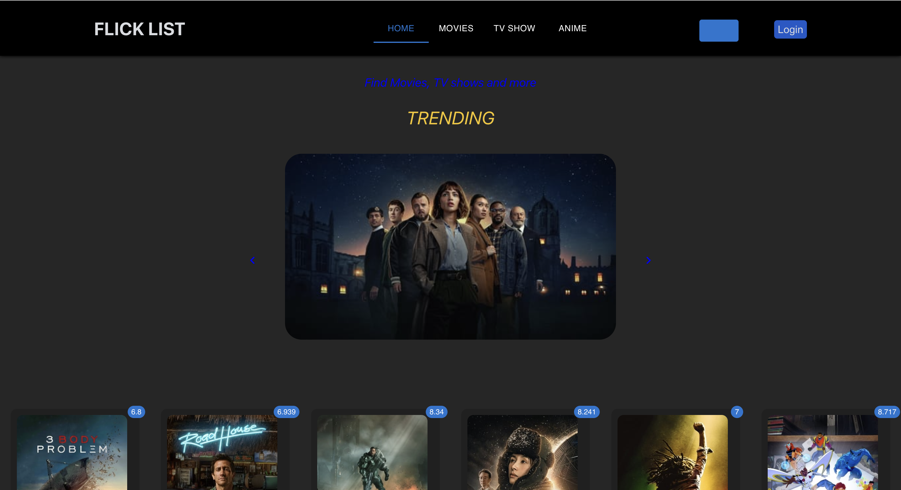
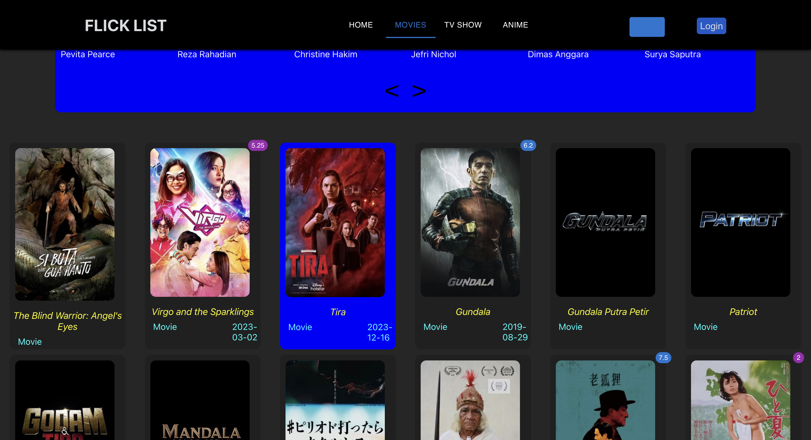

# Flick List (Movie & TV app)

## Description
Flick List is a full-stack application developed using React, REST API, Material-UI (MUI), and CSS. It provides users with access to a catalog of over 9000 movies and TV shows, along with profiles of over 6000 cast and crew members.

## Key Features
- Developed a full stack application, providing access to a catalog of over 9000 movies and TV shows, along with profiles of over 6000 cast and crew members.
- Utilized TMDB APIs to fetch a dataset of over 1000 entries weekly, ensuring an active information pool.
- Implemented features like search, genre filtering, and sorting, enhancing user experience and functionality.

## Technologies Used
- React
- JavaScript
- TMDB (for data extraction)
- REST API
- Material-UI (MUI)
- CSS
- HTML

## Project Features

Video Link -

[Carousel](https://drive.google.com/file/d/1fjLC8_ar_ej-OwcVweSJI4Po3zpzNXVG/view?usp=drive_link)

[Modules](https://drive.google.com/file/d/1Kma79QngzjMiES21Xv4BbnoRp53rYNKs/view?usp=drive_link)

[Pagination](https://drive.google.com/file/d/1BWQAMaGZoN-3dVtpFp5L9v_csbUTMMLx/view?usp=drive_link)

[Information Page](https://drive.google.com/file/d/1qPHjL9w2SKnhlu2X36fyd-vo3VPAesjj/view?usp=drive_link)

